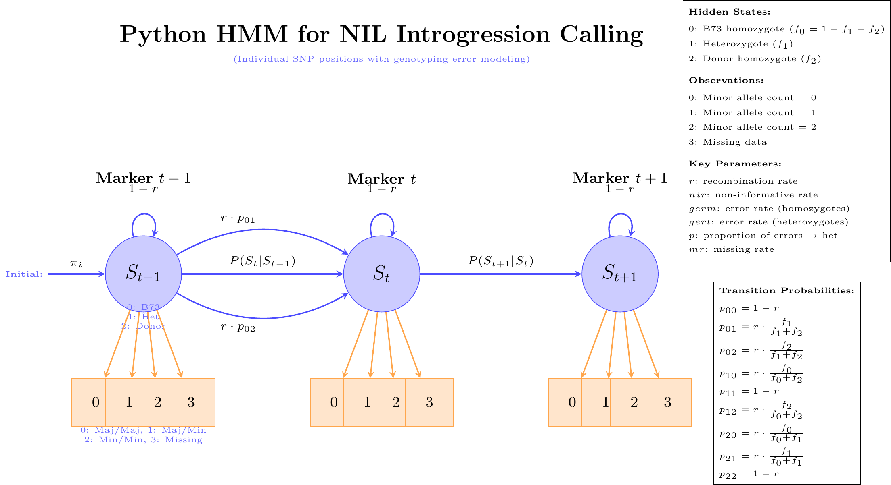

# NIL HMM: Hidden Markov Model for Introgression Calling in Near Isogenic Lines

[](https://www.python.org/)
[](LICENSE)

## Overview

This repository implements a sophisticated Hidden Markov Model (HMM) approach for calling introgressions in Near Isogenic Lines (NILs) from low-coverage sequencing data. The method is specifically designed for maize genetics applications, particularly the BZea population (B73 × Teosinte NIL population).

The HMM operates at individual SNP resolution and incorporates detailed genotyping error modeling, making it well-suited for low-coverage sequencing data (0.8× coverage) where genotype calling uncertainty is significant.

## Key Features

- **High-resolution analysis**: Works on individual SNP positions rather than binned data
- **Sophisticated error modeling**: Explicit modeling of genotyping errors with multiple parameters
- **Missing data handling**: Dedicated missing data state in the emission matrix
- **VCF input support**: Direct processing of VCF files from sequencing pipelines
- **Optimized for low coverage**: Parameters tuned for 0.8× coverage sequencing data
- **Comprehensive output**: Raw calls, summary statistics, and visualization-ready formats

## HMM Architecture

The Hidden Markov Model uses three hidden states representing different ancestry classes and four observable genotype states:



### Hidden States
- **State 0**: B73 homozygote (recurrent parent)
- **State 1**: Heterozygote (B73/Teosinte)
- **State 2**: Donor homozygote (Teosinte)

### Observations
- **0**: Major allele homozygote (minor allele count = 0)
- **1**: Heterozygote (minor allele count = 1)
- **2**: Minor allele homozygote (minor allele count = 2)
- **3**: Missing genotype call

### Key Mathematical Components

#### Transition Probabilities
The model uses genetics-based transition probabilities incorporating recombination:

- **No recombination**: P(S_t = i | S_{t-1} = i) = 1-r
- **Recombination transitions**: Weighted by expected state frequencies

```
p₀₀ = 1-r
p₀₁ = r × f₁/(f₁+f₂)
p₀₂ = r × f₂/(f₁+f₂)
p₁₀ = r × f₀/(f₀+f₂)
p₁₁ = 1-r
p₁₂ = r × f₂/(f₀+f₂)
p₂₀ = r × f₀/(f₀+f₁)
p₂₁ = r × f₁/(f₀+f₁)
p₂₂ = 1-r
```

#### Emission Probabilities
Complex formulas incorporating multiple error sources:

- **germ**: SNP calling error rate on true homozygotes
- **gert**: SNP calling error rate on true heterozygotes  
- **nir**: Non-informative marker rate
- **p**: Proportion of homozygous errors resulting in heterozygous calls
- **mr**: Missing genotype call rate

## Installation

### Requirements
- Python 3.7+
- NumPy
- Pandas
- hmmlearn
- (Optional) matplotlib/seaborn for visualization

### Setup
```bash
git clone <repository-url>
cd nilhmm
pip install -r requirements.txt  # Create if needed
```

### Dependencies
```bash
pip install numpy pandas hmmlearn argparse pathlib
```

## Usage

### Command Line Interface

Basic usage with a VCF file:
```bash
python bzea_vcf_introgression_caller.py your_data.vcf
```

With custom output prefix:
```bash
python bzea_vcf_introgression_caller.py your_data.vcf -o bzea_results
```

With adjusted parameters for your specific data:
```bash
python bzea_vcf_introgression_caller.py your_data.vcf \
    --mr 0.2 \
    --germ 0.08 \
    --gert 0.12 \
    --r 0.015
```

### Parameter Options

| Parameter | Description | Default | Notes |
|-----------|-------------|---------|-------|
| `--nir` | Non-informative rate | 0.01 | Proportion of non-informative markers |
| `--germ` | Error rate (homozygotes) | 0.05 | SNP calling error on true homozygotes |
| `--gert` | Error rate (heterozygotes) | 0.10 | SNP calling error on true heterozygotes |
| `--p` | Proportion errors → het | 0.5 | Fraction of homozygous errors called as het |
| `--mr` | Missing call rate | 0.15 | Higher for low coverage data |
| `--r` | Recombination rate | 0.01 | Between adjacent markers |
| `--f1` | Heterozygote frequency | 0.25 | Expected in NIL population |
| `--f2` | Donor homozygote freq | 0.05 | Expected introgression frequency |

### Python API

```python
from File_S11_callIntrogressions import call_intros
from bzea_vcf_introgression_caller import vcf_to_genotype_matrix

# Load and process VCF
geno_matrix, marker_dict, samples, markers = vcf_to_genotype_matrix("data.vcf")

# Call introgressions
calls = call_intros(
    geno=geno_matrix,
    marker_dict=marker_dict,
    nir=0.01, germ=0.05, gert=0.10,
    p=0.5, mr=0.15, r=0.01,
    f_1=0.25, f_2=0.05
)
```

## Input Data Format

### VCF Requirements
- Standard VCF format (v4.0+)
- Compressed (.vcf.gz) or uncompressed (.vcf)
- GT (genotype) field required in FORMAT column
- Chromosomes 1-10 (standard maize chromosomes)
- Sample names in header line

### Example VCF Header
```
##fileformat=VCFv4.2
##contig=<ID=1,length=308452471>
##FORMAT=<ID=GT,Number=1,Type=String,Description="Genotype">
#CHROM	POS	ID	REF	ALT	QUAL	FILTER	INFO	FORMAT	Sample1	Sample2	Sample3
1	1000	.	A	T	60	PASS	.	GT	0/0	0/1	1/1
```

## Output Files

The script generates four output files:

1. **`*_introgression_calls.txt`**: Raw numeric matrix (samples × markers)
   - 0 = B73 homozygote, 1 = Heterozygote, 2 = Donor homozygote

2. **`*_introgression_calls.csv`**: Labeled calls with sample and marker names
   - Same data as above but with informative row/column labels

3. **`*_introgression_summary.csv`**: Per-sample summary statistics
   - Total markers, counts and percentages for each ancestry class

4. **`*_marker_info.csv`**: Marker details
   - Chromosome, position, marker ID, reference and alternate alleles

### Example Summary Output
```csv
Sample,Total_markers,B73_homoz,Heterozygous,Donor_homoz,Pct_B73,Pct_Het,Pct_Donor
NIL001,45230,42845,1892,493,94.7,4.2,1.1
NIL002,45230,41023,3156,1051,90.7,7.0,2.3
```

## Model Comparison: Python vs R Implementation

| Aspect | Python HMM | R Implementation |
|--------|------------|------------------|
| **Resolution** | Individual SNPs | 1Mb bins |
| **Error modeling** | Explicit multi-parameter | Simplified empirical |
| **Missing data** | Dedicated state (obs=3) | Preprocessing step |
| **Transitions** | Genetics-based with recombination | Simple high/low probability |
| **Emission matrix** | 3×4 (states × observations) | 3×3 matrix |
| **Use case** | High-resolution, low coverage | Rapid screening, high coverage |

## Biological Context

### BZea Population
The BZea population consists of Near Isogenic Lines derived from crosses between:
- **Recurrent parent**: B73 (modern maize inbred line)
- **Donor parent**: Teosinte (wild ancestor of maize)

This creates a population where most of the genome is B73-derived, with small introgressed segments from teosinte that can be detected and quantified using this HMM approach.

### Applications
- **QTL mapping**: Identify teosinte alleles affecting traits of interest
- **Adaptive introgression**: Study beneficial alleles from wild relatives
- **Population genetics**: Understand introgression patterns and selection
- **Breeding programs**: Track donor segments in backcrossing schemes

## Files in Repository

- `File_S11_callIntrogressions.py`: Core HMM implementation
- `bzea_vcf_introgression_caller.py`: VCF processing and analysis pipeline
- `python_hmm_diagram.Rmd`: R Markdown documentation with model diagrams
- `jim_hmm.png`: Rendered HMM architecture diagram
- `README.md`: This documentation

## Citation

If you use this software in your research, please cite:

```
[Citation to be added when published]
```

## Contributing

Contributions are welcome! Please feel free to submit issues, feature requests, or pull requests.

## License

This project is licensed under the MIT License - see the LICENSE file for details.

## Contact

For questions or support, please contact [contact information].

---

*Developed for maize genetics research with applications to introgression mapping and population genomics.*
