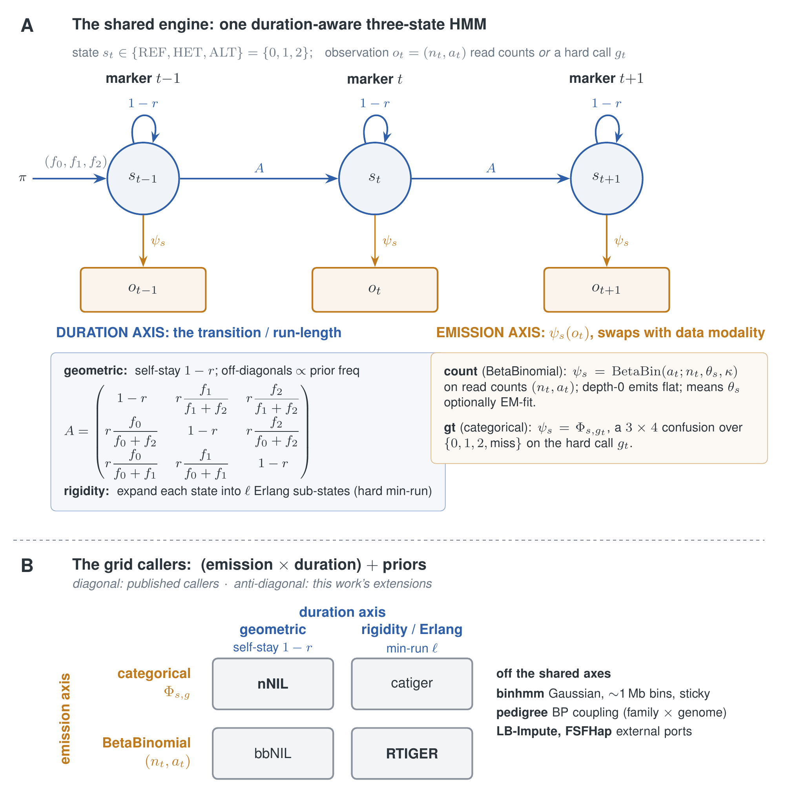

# nilHMM

<!-- badges: start -->
[](LICENSE.md)
[](https://github.com/sawers-rellan-labs/nilhmm/actions/workflows/R-CMD-check.yaml)
[](https://lifecycle.r-lib.org/articles/stages.html#experimental)
<!-- badges: end -->

**nilHMM** calls ancestry (donor introgressions) in Near-Isogenic Lines from
sequencing data. It is a single **duration-aware 3-state (REF / HET / ALT) HMM
engine** with two swappable axes:

- **emission** — `count` (BetaBinomial over ref/alt read depths) or `gt`
  (categorical genotype model with an explicit genotyping-error model), and
- **duration** — `geometric`, `rigidity` (a minimum-run-length prior), or `hsmm`.



Those choices, plus a per-unit calling rule, express a family of named **callers**.
The four pure cells of the (emission × duration) grid are `nnil` (gt + geometric),
`bbnil` (count + geometric), `catiger` (gt + rigidity), and `rtiger` (count +
rigidity), plus the GOOGA-threshold transcript pair `googa` (gt + geometric,
faithful) and `atlas` (gt + rigidity, this work); off the grid sit `binhmm`,
`lbimpute`, `fsfhap`, and `pedigree`. (The no-HMM per-site *genotype* baseline is
`call_gt()`, not an ancestry caller — see below.) The package is
**data-agnostic** — every function takes `(data, params)` and returns calls;
pipeline scripts own file paths and sample lists. The whole API is one verb:

```r
call_ancestry(data, caller = ..., design = ..., rrate = ..., err = ...)
```

nilHMM began as my Python optimization of Jim Holland's
[nNIL](https://github.com/ncsumaize/nNIL) methodology; it is now an R + Rcpp
package. My Python optimization is frozen at [`legacy/python/`](legacy/python/)
(tag `python-final`); Jim's original nNIL lives at
[`ncsumaize/nNIL`](https://github.com/ncsumaize/nNIL).

## Installation

```r
# install.packages("devtools")
devtools::install_github("sawers-rellan-labs/nilhmm")
```

Building from source needs a **C++ toolchain** (the engine is Rcpp /
RcppParallel). The `rtiger` caller is a **Julia-free port** of the RTIGER HMM, so
no Julia install is required. `rebmix` is an optional `Suggests` (only for
bit-exact reproduction of the original `binhmm` clustering backend).

## Quick start

```r
library(nilHMM)

# Read allelic counts (headerless "chr pos ref n_ref alt n_alt" TSV, or a
# directory of them) into the engine's observation table, then call ancestry.
calls <- call_ancestry(
  read_counts("path/to/sample_counts.tsv"),
  caller = "bbnil",    # low-coverage count caller (BetaBinomial + geometric)
  design = "BC2S2",    # breeding-design priors (f_1, f_2)
  rrate = 1e-4,        # recombination / geometric self-transition
  err   = 0.01         # baseline read error for the count emission
)

# calls is the common segment schema:
#   source, donor, name, chr, start_bp, end_bp, state   (state in {REF, HET, ALT})
head(calls)
```

For saturated-depth data with trustworthy called genotypes (e.g. target
sequencing), read the VCF `GT` field instead and let it select the categorical
emission:

```r
calls <- call_ancestry(read_vcf_gt("target.vcf.gz"),
                       caller = "nnil", design = "BC2S2")   # nnil = categorical gt caller
```

For **full-sib families** (TASSEL FSFHap), read the HapMap + pedigree, attach the
family grouping, and call — pooling each family:

```r
data <- read_hapmap("family.hmp.txt")                    # -> name, chr, pos, g
ped  <- read_pedigree("family_pedigree.txt")             # -> taxon, family, contribution, F
data$family <- ped$family[match(data$name, ped$taxon)]
stopifnot(!anyNA(data$family))                           # every sample must be in the pedigree
calls <- call_ancestry(data, caller = "fsfhap", design = "BC1S4")   # design routes + derives phet
```

## The callers

All callers share the 3-state REF/HET/ALT chain and the design priors; they differ
in emission, duration, and the input they expect. The four **grid** callers are the
pure (emission × duration) cells; the rest sit off the grid.

| caller | emission | duration | typical input | key parameters | lineage |
|---|---|---|---|---|---|
| **`nnil`** | `gt` (categorical) | geometric | called `GT` (hard genotypes) | `rrate`, `germ`, `gert` | Holland [nNIL](https://github.com/ncsumaize/nNIL) |
| **`bbnil`** | `count` (BetaBinomial) | geometric | allelic read counts (low-cov skim / BrB) | `rrate`, `err`, `conc`, `fit_means` | low-coverage count extension of nNIL |
| **`catiger`** | `gt` (categorical) | rigidity (min run length) | called `GT` (hard genotypes) | `rigidity`, `germ`, `gert` | categorical + rigidity |
| **`rtiger`** | `count` (BetaBinomial) | rigidity (min run length) | allelic read counts | `rigidity`, `seed`, `threads` | [RTIGER](https://github.com/rfael0cm/RTIGER) (Julia-free port of [`faustovrz/RTIGER`](https://github.com/faustovrz/RTIGER)) |
| **`binhmm`** | anchored Gaussian on binned alt-freq | per-bin HMM smooth | allelic read counts | `bin_size`, `cluster_method` | "Ancestry Analysis by bins" |
| **`googa`** | `gt` (categorical, GOOGA thresholds) | geometric | competitive-alignment recurrent/donor read counts (RNA-seq) | `atlas_thresh`, `atlas_het`, `atlas_min_reads` | GOOGA competitive alignment (Flagel 2019 / Veltsos 2024), faithful |
| **`atlas`** | `gt` (categorical, GOOGA thresholds) | rigidity (min run length) | competitive-alignment recurrent/donor read counts (RNA-seq) | `rigidity`, `atlas_thresh`, `atlas_het`, `atlas_min_reads` | this work's rigidity transcript caller |
| **`lbimpute`** | coverage-aware (LB-Impute) | distance-based (double-recomb penalty) | allelic read counts (biallelic; GBS / skim) | `err`, `genotypeerr`, `recombdist`, `drp` | [LB-Impute](https://github.com/dellaporta-laboratory/LB-Impute) (Fragoso et al. 2014) |
| **`fsfhap`** | genotype-error (5-state EM) | distance-scaled (Haldane) | called `GT` for **full-sib families** (HapMap / VCF) + a `family` grouping | `design` (or `phet`), `family`, `threads` | [FSFHap](https://bitbucket.org/tasseladmin/tassel-5-source) (Swarts et al. 2014, TASSEL) |
| **`pedigree`** | count or `gt` (input-detected) | BP over pedigree × genome | read counts or a hard-call `state`/`g`, plus a pedigree | `design`, `rrate`, `ped_*` | family-coupled belief propagation |

- `nnil` — the categorical caller on **called genotypes** (Holland's error model:
  `germ`, `gert`, `p`, `mr`, `nir`); it takes a `g` column and does **not** threshold
  read counts into genotypes — hard-calling is your explicit step (e.g. `call_gt()`),
  never a silent one inside the caller. Geometric duration, so the self-transition
  is the smoother.
- `bbnil` — the low-coverage count extension: pools single-read observations along
  a segment via a BetaBinomial emission (`err`, `conc`); `fit_means = TRUE` EM-fits
  the per-state alt fractions. Same geometric duration as `nnil`.
- `catiger` — the categorical `gt` emission with the rigidity (minimum-run-length)
  duration; the `gt`-side counterpart of `rtiger`.
- `rtiger` — a faithful reimplementation of the RTIGER rigidity HMM (EM + Viterbi,
  border re-placement), ported off Julia; `rigidity` is the integer minimum run
  length.
- `binhmm` — bins the genome (default 1 Mb), calls per-bin state with an anchored
  3-state Gaussian-emission HMM (the default `cluster_method = "gauss"` fixes HET
  over-call and high-coverage fragmentation), with the original GMM/k-means/rebmix
  clustering backends available for reproduction.
- `googa` / `atlas` — callers for transcript / competitive-alignment data:
  recurrent vs donor read fractions are thresholded into hard genotype calls
  (`atlas_thresh`, `atlas_het`, `atlas_min_reads`), then smoothed. **`googa`** is
  the faithful reproduction — gt + **geometric**, matching GOOGA's
  recombination-fraction F2 HMM (Flagel 2019; Veltsos 2024), which carries no
  minimum-run/rigidity duration. **`atlas`** is this work's transcript caller: the
  same thresholding decoded with the **rigidity** duration.
- `lbimpute` — a native port of LB-Impute (Fragoso et al. 2014) for biallelic
  populations: a coverage-aware emission (bounded by
  `genotypeerr` so one artifactual marker can't dominate) and a distance-dependent
  transition (recombination scales with the marker gap over `recombdist`; the
  homozygous↔homozygous switch carries a double-recombination penalty unless
  `drp = TRUE`, for RILs). The transition decays over physical bp (`unit = "bp"`,
  the faithful uniform-rate model) or, with a `cm` column of map positions,
  genetic distance (`unit = "cm"`) so the *local* recombination rate — e.g. maize
  centromeric suppression — is captured; output coordinates stay bp either way,
  and `recombdist`'s default is unit-aware (`1e7` bp / `50` cM). Decoded with the
  engine's full-chromosome Viterbi — the optimal path that LB-Impute's windowed
  forward/reverse consensus approximates. Emit an imputed VCF from the result
  with `write_vcf_impute()`.
- `fsfhap` — a native port of TASSEL's **FSFHap** (Swarts et al. 2014) for
  **full-sib families**, pooling each family (not per-line). Two design-routed
  parent-calling routes: the **backcross** route (BC1, `contribution = 0.75`) and
  the general **`BiparentalHaplotypeFinder`** route (reconstructs two parental
  haplotypes), both feeding the 5-state Viterbi-training EM imputation + gap-fill.
  Bit-exact vs TASSEL on its intended populations (backcross and **RIL/inbred**);
  het-heavy F2 is a documented stress case. `design` (a `BC{n}S{m}` token) selects
  the route and derives the expected heterozygosity `phet = (1-F)/2`; supply the
  `family` grouping via a `family` column or the `family=` argument. **Not** for
  NILs with heterozygous/outbred donors — use `nnil` (donor-agnostic) there.
  Read the native input with `read_hapmap()` + `read_pedigree()`.
- `pedigree` — family-coupled loopy belief propagation over the (pedigree × genome)
  grid; emission is input-detected (read counts → count/BetaBinomial, a hard-call
  `state`/`g` column → categorical gt). Requires a `pedigree` and `design`, and
  dispatches per family.
### The no-HMM genotype baseline (not an ancestry caller)

The het-excess "control" is a per-site **genotype** call, not an ancestry caller —
nilHMM keeps a wall between the ancestry mosaic and genotypes. Call it directly with
`call_gt()`: each `(marker, sample)` decided independently from its own read counts,
no linkage. `prior = "flat"` gives the pure argmax genotype-likelihood (**maximum
likelihood**, het-blind at depth 1); `prior = "hwe"` gives the Hardy–Weinberg
posterior **MAP** (deliberately **het-excess** at low depth — the reference the
ancestry callers must beat). If you want those genotypes in the ancestry comparison,
convert them yourself (`to_segments()` on the genotype-as-state) — the package
provides no genotype→mosaic caller shortcut.

## Related building blocks

`read_counts()`, `read_vcf_gt()`, `read_hapmap()`, `read_plink()`,
`read_pedigree()` (I/O); `caller_spec()`, `emission_count()`,
`emission_gt()`, `duration_geometric()`, `duration_rigidity()`,
`duration_hsmm()`, `design_priors()`, `fit()`, `decode()` (engine internals);
`calibrate_r()`, `select_emission()` (calibration); `plot_fragment_sizes()`,
`write_common_schema()`, `write_vcf_impute()` (output). See `?call_ancestry` and the package
documentation for the full reference.

## Documentation & benchmarks

- Package site (pkgdown): <https://sawers-rellan-labs.github.io/nilhmm/>
- Caller comparison & the methods paper live in the companion
  [`zealhmm`](https://github.com/sawers-rellan-labs/zealhmm) analysis repo, which
  installs nilHMM as a dependency.

## Citation

If you use nilHMM, please cite the nilHMM methods paper, the software, and the
nNIL population paper it is built on — see `CITATION`.

> Rodríguez-Zapata, F., Tandukar, N., Holland, J.B., & Rellán-Álvarez, R. (2026).
> *Simulation calibrated HMM ancestry calling for Near Isogenic Lines across
> sequencing modalities (nilHMM)*. **Manuscript in preparation.**

```
Zhong, T., Mullens, A., Morales, L., Swarts, K.L., Stafstrom, W.C., He, Y.,
Sermons, S.M., Yang, Q., Lopez-Zuniga, L.O., Rucker, E., Thomason, W.E.,
Nelson, R.J., Jamann, T., Balint-Kurti, P.J., & Holland, J.B. (2025).
A maize near-isogenic line population designed for gene discovery and
characterization of allelic effects. bioRxiv.
https://doi.org/10.1101/2025.01.29.635337
```

## License

MIT — see [LICENSE.md](LICENSE.md).
