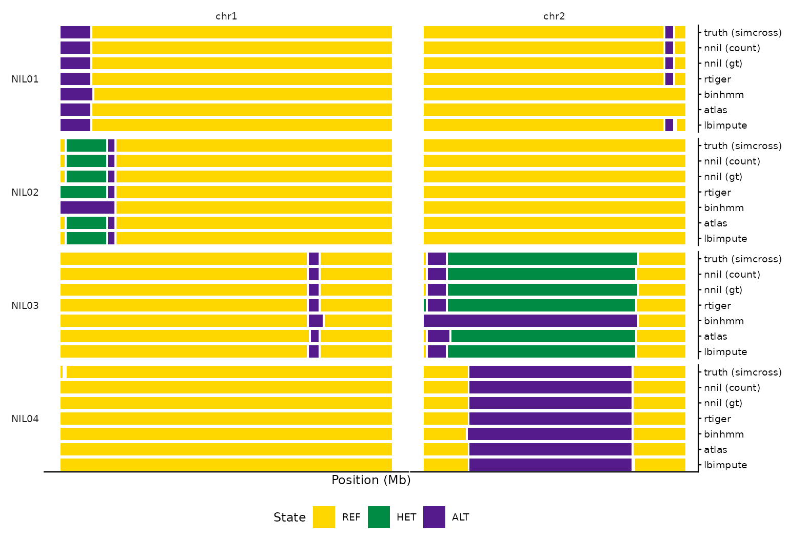

# The callers: one example each

nilHMM ships six named callers. They all share the 3-state REF/HET/ALT
chain and the breeding-design priors, and all return the same segment
schema — so you can run several on the same data and compare directly.
They differ in the **emission** model, the **duration** prior, and the
**input** they expect. This vignette runs one minimal example of each on
self-contained synthetic data.

``` r

library(nilHMM)
```

## Synthetic data

[`simulate_nil()`](https://sawers-rellan-labs.github.io/nilhmm/reference/simulate_nil.md)
builds a BC2S2 cohort (donor **B** on recurrent parent **A**) on the
bundled maize map — the **truth** — and
[`simulate_counts()`](https://sawers-rellan-labs.github.io/nilhmm/reference/simulate_counts.md)
degrades it to observed data carrying **both** allelic counts
(`n_ref`/`n_alt`, for the count callers) and a hard genotype `g` in
`{0,1,2,3}` (for the genotype callers):

``` r

truth <- simulate_nil("BC2S2", n = 8, chr = 1:2, n_markers = 300, donor = "B",
                      names = sprintf("NIL%02d", 1:8), seed = 1)
obs   <- simulate_counts(truth, depth = 6, seed = 1)
counts <- obs[c("name", "donor", "chr", "pos", "n_ref", "n_alt")]
gt     <- obs[c("name", "donor", "chr", "pos", "g")]
```

## `nnil` — count and genotype

Holland’s nNIL caller. With allelic counts it pools single-read
observations along a segment via a BetaBinomial emission (`err`, `conc`;
`fit_means = TRUE` EM-fits the per-state alt fractions). Given only a
called genotype `g`, it switches to the categorical genotype emission
automatically.

``` r

nnil_count <- call_ancestry(counts, caller = "nnil", design = "BC2S2",
                            rrate = 1e-4, err = 0.01)
nnil_gt    <- call_ancestry(gt, caller = "nnil", design = "BC2S2")  # g-only -> gt emission
nrow(nnil_count); nrow(nnil_gt)
#> [1] 50
#> [1] 51
```

## `rtiger` — rigidity segmentation

A Julia-free port of the RTIGER rigidity HMM (EM + Viterbi + border
re-placement). `rigidity` is the integer minimum run length.

``` r

rt <- call_ancestry(counts, caller = "rtiger", design = "BC2S2",
                    rigidity = 5L, seed = 1L)
head(rt, 3)
#>   source donor  name chr start_bp    end_bp state
#> 1 nilHMM     B NIL01   1    37410  27727705     2
#> 2 nilHMM     B NIL01   1 29573725 308322690     0
#> 3 nilHMM     B NIL01   2    98554 223047189     0
```

## `binhmm` — per-bin calling

Bins the genome (default 1 Mb) and calls per-bin state with an anchored
3-state Gaussian-emission HMM. Good for noisy or uneven coverage.

``` r

bh <- call_ancestry(counts, caller = "binhmm", design = "BC2S2", bin_size = 5e6)
head(bh, 3)
#>   source donor  name chr start_bp    end_bp state
#> 1 nilHMM     B NIL01   1    37410  29573725     2
#> 2 nilHMM     B NIL01   1 31419744 308322690     0
#> 3 nilHMM     B NIL01   2    98554 243484148     0
```

## `atlas` — competitive-alignment (GOOGA)

For transcript / competitive-alignment data: `n_ref`/`n_alt` are the
recurrent and donor read counts, thresholded into genotype calls (GOOGA
style) then smoothed.

``` r

at <- call_ancestry(counts, caller = "atlas", design = "BC2S2",
                    atlas_thresh = 0.95, atlas_het = 0.25, atlas_min_reads = 5L)
head(at, 3)
#>   source donor  name chr start_bp    end_bp state
#> 1 nilHMM     B NIL01   1    37410  27727705     2
#> 2 nilHMM     B NIL01   1 29573725 308322690     0
#> 3 nilHMM     B NIL01   2    98554 243484148     0
```

## `lbimpute` — very low coverage

A native port of LB-Impute (Fragoso et al. 2014) for `<1×` biallelic
populations: a coverage-aware emission bounded by `genotypeerr`, and a
distance-dependent transition (recombination scales with the marker gap
over `recombdist`). No design priors needed.

``` r

lb <- call_ancestry(counts, caller = "lbimpute", recombdist = 1e7, genotypeerr = 0.05)
head(lb, 3)
#>   source donor  name chr start_bp    end_bp state
#> 1 nilHMM     B NIL01   1    37410  27727705     2
#> 2 nilHMM     B NIL01   1 29573725 308322690     0
#> 3 nilHMM     B NIL01   2    98554 223047189     0
```

## `fsfhap` — full-sib families

A port of TASSEL’s FSFHap. Unlike the per-line callers it **pools each
family**, so it needs a `family` grouping and a called genotype `g`. See
[`vignette("fsfhap")`](https://sawers-rellan-labs.github.io/nilhmm/articles/fsfhap.md)
for the full workflow (HapMap + pedigree input, design routing,
parallelism).

``` r

fam <- transform(gt, family = donor)          # a family grouping on the genotype table
# (a real family needs enough segregating markers; see vignette("fsfhap"))
```

## Comparing callers

Because the output schema is shared, comparison is a table join away —
e.g. how many segments and which states each caller produced on the same
counts:

``` r

summ <- function(x) c(segments = nrow(x), states = length(unique(x$state)))
rbind(nnil = summ(nnil_count), rtiger = summ(rt), binhmm = summ(bh),
      atlas = summ(at), lbimpute = summ(lb))
#>          segments states
#> nnil           50      3
#> rtiger         48      3
#> binhmm         32      2
#> atlas          48      3
#> lbimpute       51      3
```

### Chromosome painting

The real payoff of the shared schema is that you can **paint every
caller on the same axes** — against the simcross **ground truth** — and
eyeball whether the independent methods recover the donor (**B**)
blocks. Each row is a NIL, each column a chromosome, and within a cell
the tracks are stacked as bands (REF gold / HET green / ALT purple),
with the noise-free truth on top.

The truth track is just
[`to_segments()`](https://sawers-rellan-labs.github.io/nilhmm/reference/to_segments.md)
on the
[`simulate_nil()`](https://sawers-rellan-labs.github.io/nilhmm/reference/simulate_nil.md)
table (its `state` is the noise-free donor mosaic, before
[`simulate_counts()`](https://sawers-rellan-labs.github.io/nilhmm/reference/simulate_counts.md)
added depth and missingness).
[`paint_calls()`](https://sawers-rellan-labs.github.io/nilhmm/reference/paint_calls.md)
then stacks it above the callers: `rbind` each track’s segments with a
column naming it, and pass that column as `track` (its levels stack
top-down, so truth goes first).

``` r

tracks <- list("nnil (count)" = nnil_count, "nnil (gt)" = nnil_gt,
               rtiger = rt, binhmm = bh, atlas = at, lbimpute = lb)
comparison <- do.call(rbind, Map(function(seg, m) { seg$method <- m; seg },
                                 tracks, names(tracks)))

# simcross ground truth (the simulate_nil() table) as the top track
truth_seg <- to_segments(truth)
truth_seg$method <- "truth (simcross)"

comparison <- rbind(truth_seg, comparison)
comparison$method <- factor(comparison$method,
                            levels = c("truth (simcross)", names(tracks)))
paint_calls(comparison, track = "method", samples = sprintf("NIL%02d", 1:4))
```



The callers recover the true donor blocks — each caller’s band lines up
with the truth on top — with expected method-specific behaviour
(e.g. `binhmm` paints broader per-bin blocks). This is the same painting
used for the real coverage-sweep NILs, where the truth track is instead
an independent data source or a high-confidence call set.

For per-caller parameters and lineage, see
[`?call_ancestry`](https://sawers-rellan-labs.github.io/nilhmm/reference/call_ancestry.md)
and the README caller table. \`\`\`
