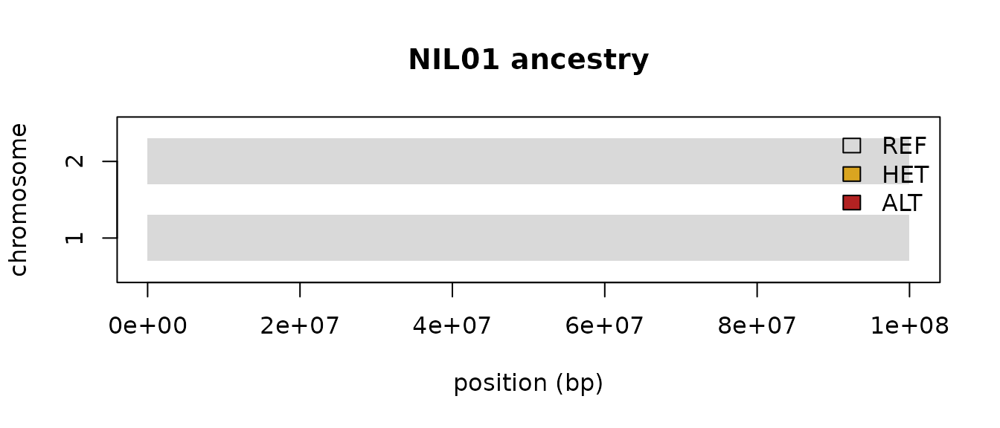

# Getting started with nilHMM

**nilHMM** calls ancestry — donor introgressions — in Near-Isogenic
Lines and related backcross/full-sib populations from sequencing data.
Under the hood it is a single **duration-aware 3-state (REF / HET / ALT)
HMM engine** with two swappable axes (emission × duration); their
combinations, plus breeding-design priors, express a family of named
callers (the grid cells `nnil`, `bbnil`, `catiger`, `rtiger`, plus
`googa`, `atlas`, `binhmm`, `lbimpute`, `fsfhap`, `pedigree`). This
vignette covers the common workflow; see
[`vignette("callers")`](https://sawers-rellan-labs.github.io/nilhmm/articles/callers.md)
to choose a caller,
[`vignette("engine")`](https://sawers-rellan-labs.github.io/nilhmm/articles/engine.md)
for the internals, and
[`vignette("fsfhap")`](https://sawers-rellan-labs.github.io/nilhmm/articles/fsfhap.md)
for full-sib families.

``` r

library(nilHMM)
```

## Ancestry mosaics, not genotype calls

nilHMM infers **ancestry** — the REF/HET/ALT donor-introgression state
*along each chromosome* (the “mosaic”), reconstructed by borrowing
strength across neighbouring markers through the HMM’s linkage
(duration) model. That is a different operation from **genotype
calling** — deciding the genotype at a marker from *that marker’s own
read observations*, one site at a time, with no linkage. The package
keeps the two apart on purpose:

- **Genotype calling** is
  [`call_gt()`](https://sawers-rellan-labs.github.io/nilhmm/reference/call_gt.md)
  — per site, no linkage (`prior = "flat"` = maximum-likelihood call;
  `prior = "hwe"` = the het-excess HWE-MAP baseline). Its output is a
  genotype `0/1/2`: an observation, not an ancestry inference.
- **Ancestry inference** is the family of **callers**, run through
  [`call_ancestry()`](https://sawers-rellan-labs.github.io/nilhmm/reference/call_ancestry.md).
  Its output is the common segment schema — the ancestry mosaic.

The wall is enforced, not incidental: an ancestry caller never silently
calls genotypes for you (`nnil`/`catiger` require *called* genotypes and
will not threshold read counts), and
[`call_gt()`](https://sawers-rellan-labs.github.io/nilhmm/reference/call_gt.md)
is not dispatchable through
[`call_ancestry()`](https://sawers-rellan-labs.github.io/nilhmm/reference/call_ancestry.md).
The rest of this vignette is about the **ancestry** side;
[`vignette("callers")`](https://sawers-rellan-labs.github.io/nilhmm/articles/callers.md)
walks the wall in detail.

## The one-verb API

Everything funnels through a single call:

``` r

call_ancestry(data, caller = ..., design = ..., ...)
```

`data` is a tidy long table the readers produce; `caller` picks the
model; `design` supplies the breeding-design priors. The package is
**data-agnostic** — functions take `(data, params)` and never touch file
paths, so you own where data comes from and where results go.

## A worked example

We need an observation table. In practice you read one with
[`read_counts()`](https://sawers-rellan-labs.github.io/nilhmm/reference/read_counts.md)
(a `chr pos ref n_ref alt n_alt` TSV or a directory of them),
[`read_vcf_gt()`](https://sawers-rellan-labs.github.io/nilhmm/reference/read_vcf_gt.md),
[`read_hapmap()`](https://sawers-rellan-labs.github.io/nilhmm/reference/read_hapmap.md),
or
[`read_plink()`](https://sawers-rellan-labs.github.io/nilhmm/reference/read_plink.md).
Here we generate one with the package’s own design-driven simulator:
[`simulate_nil()`](https://sawers-rellan-labs.github.io/nilhmm/reference/simulate_nil.md)
builds a breeding design and runs it through
[**simcross**](https://cran.r-project.org/package=simcross) (real
meiosis and recombination on the **bundled B73 v5 consensus map**,
\[load_map()\]) to get the true donor mosaic, and
[`simulate_counts()`](https://sawers-rellan-labs.github.io/nilhmm/reference/simulate_counts.md)
degrades that truth to observed allelic read counts. We take a **BC2S2**
cohort — six lines on chromosomes 1–2, donor **B** crossed onto
recurrent parent **A** (so `REF` = A, `ALT` = donor B):

``` r

truth  <- simulate_nil("BC2S2", n = 6, chr = 1:2, n_markers = 300, donor = "B",
                       names = sprintf("NIL%02d", 1:6), seed = 1)   # true donor mosaic
counts <- simulate_counts(truth, depth = 6, seed = 1)[        # observed low-cov counts
  c("name", "donor", "chr", "pos", "n_ref", "n_alt")]
head(counts)
#>    name donor chr     pos n_ref n_alt
#> 1 NIL01     B   1   37410     0     4
#> 2 NIL01     B   1 1883430     0     5
#> 3 NIL01     B   1 3729450     0     6
#> 4 NIL01     B   1 5575469     0     9
#> 5 NIL01     B   1 7421489     0     4
#> 6 NIL01     B   1 9267509     0     9
```

Call ancestry with the `bbnil` count caller and BC2S2 design priors:

``` r

calls <- call_ancestry(counts, caller = "bbnil", design = "BC2S2",
                       rrate = 1e-4, err = 0.01)
head(calls)
#>   source donor  name chr  start_bp    end_bp state
#> 1 nilHMM     B NIL01   1     37410  27727705     2
#> 2 nilHMM     B NIL01   1  29573725 308322690     0
#> 3 nilHMM     B NIL01   2     98554 223047189     0
#> 4 nilHMM     B NIL01   2 224905095 232336716     2
#> 5 nilHMM     B NIL01   2 234194621 243484148     0
#> 6 nilHMM     B NIL02   1     37410   3729450     0
```

## The common segment schema

Every caller returns the same tidy **segment** table, so results are
directly comparable across callers and populations:

| column | meaning |
|----|----|
| `source` | free label for the run/method |
| `donor` | donor/taxon label (per line if the input carries one) |
| `name` | sample identifier |
| `chr` | chromosome |
| `start_bp`, `end_bp` | segment bounds (bp) |
| `state` | `REF` (0, recurrent hom), `HET` (1), or `ALT` (2, donor hom) |

``` r

table(calls$state)
#> 
#>  0  1  2 
#> 20  4  9
```

Numeric states are `0 = REF`, `1 = HET`, `2 = ALT`. The package’s
[`paint_calls()`](https://sawers-rellan-labs.github.io/nilhmm/reference/paint_calls.md)
renders those segments as a chromosome painting — one band per line,
faceted by chromosome (REF gold / HET green / ALT purple):

``` r

paint_calls(calls)
```



## Which caller?

All callers share the REF/HET/ALT chain and the design priors; they
differ in the emission model, the duration prior, and the input they
expect.

| caller | input | when |
|----|----|----|
| `nnil` | called `GT` (hard genotypes) | categorical (gt) + geometric; Holland’s nNIL on hard calls |
| `bbnil` | allelic read counts | count/BetaBinomial + geometric; low-coverage skim/BrB |
| `catiger` | called `GT` (hard genotypes) | categorical (gt) + rigidity |
| `rtiger` | allelic read counts | count + minimum-run-length (rigidity) segmentation |
| `binhmm` | allelic read counts | per-bin calling for noisy/uneven coverage |
| `googa` | recurrent/donor counts | competitive-alignment RNA-seq (faithful GOOGA; gt + geometric) |
| `atlas` | recurrent/donor counts | competitive-alignment RNA-seq (this work; gt + rigidity) |
| `lbimpute` | allelic read counts | biallelic imputation (LB-Impute port; distance-dependent transition) |
| `fsfhap` | called `GT` + a `family` | full-sib families (TASSEL FSFHap) |
| `pedigree` | counts or hard-call `state`/`g` + a pedigree | family-coupled belief propagation |

[`vignette("callers")`](https://sawers-rellan-labs.github.io/nilhmm/articles/callers.md)
gives runnable examples for the per-sample callers (see
[`vignette("fsfhap")`](https://sawers-rellan-labs.github.io/nilhmm/articles/fsfhap.md)
for the family workflow). The no-HMM per-site *genotype* baseline (the
het-excess “control”) is
[`call_gt()`](https://sawers-rellan-labs.github.io/nilhmm/reference/call_gt.md),
not an ancestry caller — see
[`?call_gt`](https://sawers-rellan-labs.github.io/nilhmm/reference/call_gt.md).

## Next steps

- **Choosing and comparing callers:**
  [`vignette("callers")`](https://sawers-rellan-labs.github.io/nilhmm/articles/callers.md)
- **The engine (emission × duration, custom callers):**
  [`vignette("engine")`](https://sawers-rellan-labs.github.io/nilhmm/articles/engine.md)
- **Full-sib families (HapMap/pedigree → fsfhap):**
  [`vignette("fsfhap")`](https://sawers-rellan-labs.github.io/nilhmm/articles/fsfhap.md)
- Function reference:
  [`?call_ancestry`](https://sawers-rellan-labs.github.io/nilhmm/reference/call_ancestry.md),
  [`?read_counts`](https://sawers-rellan-labs.github.io/nilhmm/reference/read_counts.md),
  [`?to_segments`](https://sawers-rellan-labs.github.io/nilhmm/reference/to_segments.md).
  \`\`\`
