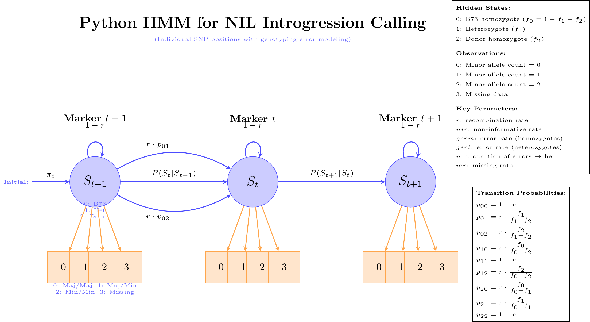

# NILHMM Documentation

## Mathematical Framework

### Hidden Markov Model Architecture



The NILHMM implements a three-state HMM for ancestry inference:

**Hidden States:**
- State 0: Recurrent parent homozygote (B73)
- State 1: Heterozygote (B73/Donor)
- State 2: Donor homozygote (Teosinte)

**Observations:**
- 0: Major allele homozygote (0/0)
- 1: Heterozygote (0/1)
- 2: Minor allele homozygote (1/1)
- 3: Missing genotype

### Transition Probabilities

Genetics-based transitions incorporating recombination:

```
p₀₀ = 1-r                    # No recombination
p₀₁ = r × f₁/(f₁+f₂)        # Recombination to heterozygote
p₀₂ = r × f₂/(f₁+f₂)        # Recombination to donor
p₁₀ = r × f₀/(f₀+f₂)        # Het to recurrent
p₁₁ = 1-r                    # Het persistence
p₁₂ = r × f₂/(f₀+f₂)        # Het to donor
p₂₀ = r × f₀/(f₀+f₁)        # Donor to recurrent
p₂₁ = r × f₁/(f₀+f₁)        # Donor to het
p₂₂ = 1-r                    # Donor persistence
```

Where:
- `r`: recombination rate between markers
- `f₀`, `f₁`, `f₂`: expected frequencies of each state

### Emission Probabilities

Complex error modeling incorporating:

**State 0 (B73 homozygote):**
```
P(obs=0|state=0) = (1-germ)(1-mr)
P(obs=1|state=0) = p×germ×(1-mr)
P(obs=2|state=0) = (1-p)×germ×(1-mr)
P(obs=3|state=0) = mr
```

**State 1 (Heterozygote):**
```
P(obs=0|state=1) = [((1-nir)×0.5×gert) + nir×(1-germ)]×(1-mr)
P(obs=1|state=1) = [((1-nir)×(1-gert)) + (nir×germ×p)]×(1-mr)
P(obs=2|state=1) = [((1-nir)×0.5×gert) + nir×germ×(1-p)]×(1-mr)
P(obs=3|state=1) = mr
```

**State 2 (Donor homozygote):**
```
P(obs=0|state=2) = [(1-nir)×germ×(1-p) + (nir×(1-germ))]×(1-mr)
P(obs=1|state=2) = germ×p×(1-mr)
P(obs=2|state=2) = [(1-nir)×(1-germ) + (nir×germ×(1-p))]×(1-mr)
P(obs=3|state=2) = mr
```

## Parameter Guide

### Core Parameters

| Parameter | Description | Typical Range | Default |
|-----------|-------------|---------------|---------|
| `r` | Recombination rate | 0.001-0.05 | 0.01 |
| `nir` | Non-informative rate | 0.01-0.1 | 0.01 |
| `germ` | Homozygote error rate | 0.02-0.1 | 0.05 |
| `gert` | Heterozygote error rate | 0.05-0.2 | 0.10 |
| `p` | Error type proportion | 0.3-0.7 | 0.5 |
| `mr` | Missing rate | 0.1-0.3 | 0.15 |

### Population Parameters

| Parameter | Description | NIL Population | BC Population |
|-----------|-------------|----------------|---------------|
| `f_1` | Heterozygote frequency | 0.2-0.3 | 0.4-0.5 |
| `f_2` | Donor frequency | 0.02-0.1 | 0.1-0.25 |

## Implementation Details

### VCF Processing

The package processes standard VCF files:

1. **Header parsing** extracts sample names
2. **Genotype conversion** maps GT calls to numeric codes
3. **Chromosome filtering** selects maize chromosomes 1-10
4. **Missing data handling** converts ./. to code 3

### HMM Implementation

Uses `hmmlearn.MultinomialHMM` with:

- **Custom initialization** prevents parameter estimation
- **Fixed parameters** based on biological knowledge
- **Viterbi decoding** finds most likely state sequence
- **Chromosome-wise processing** handles linkage appropriately

### Output Formats

1. **Raw calls matrix**: Numeric states (samples × markers)
2. **Labeled calls**: CSV with sample/marker names
3. **Summary statistics**: Per-sample ancestry proportions
4. **Marker information**: Genomic coordinates and alleles

## Comparison with Binned Methods

| Aspect | SNP-level (This package) | Binned (1Mb windows) |
|--------|-------------------------|----------------------|
| Resolution | Individual SNPs | ~1000 SNP bins |
| Error modeling | Explicit multi-parameter | Empirical probabilities |
| Missing data | Dedicated HMM state | Preprocessing filter |
| Computation | Higher memory/time | Faster processing |
| Sensitivity | Detects small segments | Misses small introgressions |

## Algorithm Workflow

1. **Parse VCF** → genotype matrix (samples × markers)
2. **Initialize HMM** → set parameters, no training
3. **Process by chromosome** → maintain linkage structure
4. **Viterbi decode** → find optimal state sequence
5. **Aggregate results** → combine chromosomes
6. **Generate outputs** → multiple file formats

## Performance Considerations

### Memory Usage
- Genotype matrix: samples × markers × 4 bytes
- For 1000 samples × 100K markers ≈ 400MB RAM

### Computational Complexity
- Per chromosome: O(T × N² × M) where T=markers, N=states, M=samples
- Total runtime: Linear in number of markers and samples

### Optimization Tips
- **Filter markers**: Remove low-quality/monomorphic sites
- **Batch processing**: Process subsets if memory limited
- **Parallel chromosomes**: Run chromosomes independently

## Validation and Quality Control

### Expected Results
- Most NIL genome should be recurrent parent (>90%)
- Introgressions should show realistic size distribution
- Heterozygote frequencies consistent with breeding scheme

### Diagnostic Checks
- State frequency distributions match expectations
- Transition patterns follow biological constraints
- Missing data rates within acceptable bounds

### Parameter Sensitivity
- `germ`/`gert`: Affect call confidence at variant sites
- `r`: Influences introgression boundary precision
- `f_1`/`f_2`: Control overall state frequency balance

## Citation

Based on the methodology described in:

```
Zhong, T., Mullens, A., Morales, L., Swarts, K.L., Stafstrom, W.C., He, Y.,
Sermons, S.M., Yang, Q., Lopez-Zuniga, L.O., Rucker, E., Thomason, W.E.,
Nelson, R.J., Jamann, T., Balint-Kurti, P.J., & Holland, J.B. (2025).
A maize near-isogenic line population designed for gene discovery and
characterization of allelic effects. bioRxiv.
https://doi.org/10.1101/2025.01.29.635337
```
